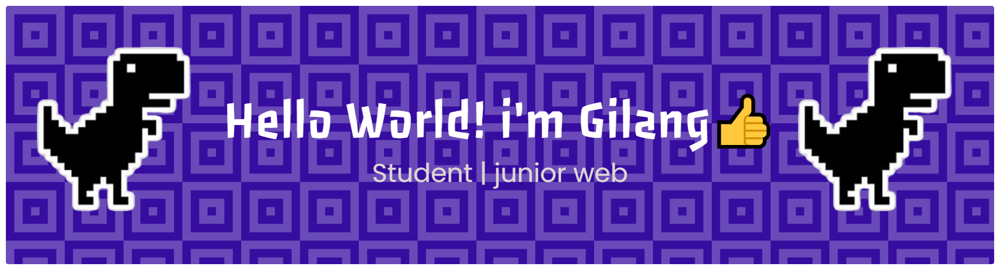

<!-- ## Hello world! I'm Gilang 👋 -->

<h1 align="left">Hey 🙌 What's up?</h1>

###

Hello World! I'm Gilang👍

###

<h2 align="left">About me</h2>

###

✨ Creating bugs since 2025 📚 I'm currently learning html,css & Js 🎯 Goals: 🚀. Passionate about building clean and responsive web interfaces. 🚀"

###

<h2 align="left">I code with</h2>

###

  
  
  
  
  
  
  
  
  

###

<picture>
  <source media="(prefers-color-scheme: dark)" srcset="https://raw.githubusercontent.com/gilangaswatama71-rgb/gilangaswatama71-rgb/output/pacman-contribution-graph-dark.svg">
  <source media="(prefers-color-scheme: light)" srcset="https://raw.githubusercontent.com/gilangaswatama71-rgb/gilangaswatama71-rgb/output/pacman-contribution-graph.svg">
  
</picture>

###

###

<h4 align="left">My stats👀👀</h4>

  

contact me

###

  
  

###

  

###